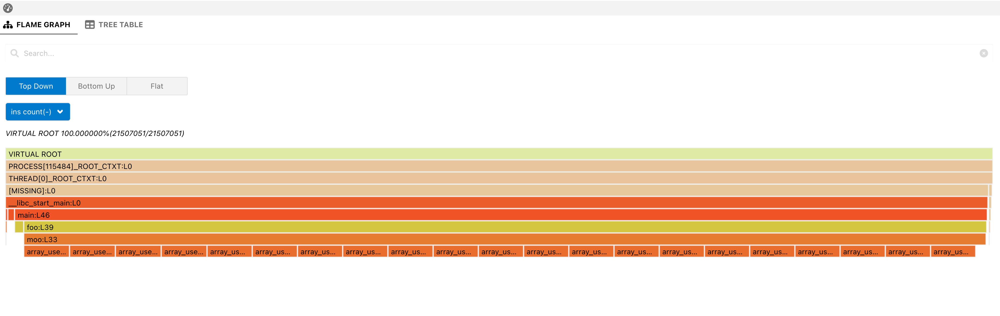

# drcctprof_tutorial

This repository includes all the necessary files for the hands-on lab for [DrCCTProf tutorial at CGO'22](https://www.xperflab.org/drcctprof/tutorial).

## Instructions on the coding assignment

Try to implement a DrCCTProf client to count **instruction instances**<sup>*</sup> within unique calling contexts.

> `*` `Instructions of the same PC (program counter) may appear in different call paths.`


You just need to complete the function [void InsCount(int32_t opaqueHandle)](https://github.com/Xuhpclab/drcctprof_tutorial/blob/main/src/client.cpp#L42-L55)
:

1. Get the current context handle.
   Tip: use API 
   ```c
    context_handle_t drcctlib_get_context_handle(void *drcontex, int32_t opaqueHandle)
   ```
2. Increment the instruction execution frequency with the current context handle
    Tip: use *ctxt_hndl_exec_num_array*  to get and store the execution frequency of each context handle.

## Build

Use the following commands to get source code and build:

```console
$ git clone --recurse https://github.com/Xuhpclab/drcctprof_tutorial.git
```

```console
$ ./build.sh
```

## Run

Once you complete the implementation, run the following command to build your source code and run the tool to profile the test application:

```console
$ ./run.sh
```

This will generate two output files: one is a text file and the other is a .drcctprof file. You can directly open the text file or open .drcctprof file in VSCode with [EasyView](https://marketplace.visualstudio.com/items?itemName=xuhpclib-easyview.easyview) installed.

### *Expected result in EasyView*

> <div align=center> </div>
